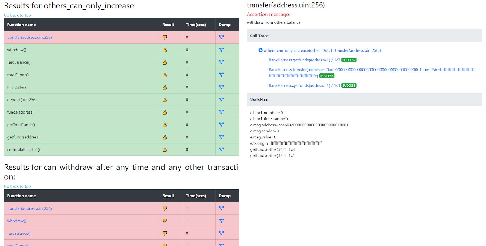

The Bank
========

Rules in the Certora Verification Language
------------------------------------------

The Certora Prover verifies that a smart contract satisfies a set of rules written in a language called _Certora Verification Language (CVL)_. Each rule is checked on all possible inputs. Of course, this is not done by explicitly enumerating the inputs, but rather through symbolic techniques. Rules can check that a public contract method has the correct effects on the contract state or returns the correct value, etc... The syntax for expressing rules somewhat resembles Solidity, but also supports more features that are important for verification. 

Consider the following contract interface to implement a simple bank:

```solidity
pragma solidity >= 0.4.24 < 0.8;
contract Bank {
  mapping (address => uint) public funds;
  uint public totalFunds;
  // get the current fund of an account
  function getFunds(address account) public returns (uint)
  // get the total funds in the bank
  function getTotalFunds() public returns (uint)
  // deposit an amount to an account
  function deposit(uint amount) public payable
  // transfer an amount to an account
  function transfer(address account, uint amount) public
  // withdraw all amounts
  function withdraw() returns (bool) public
}
```

And here is a rule for verifying that withdraw either reverts or returns true.

```cvl
rule withdraw_succeeds {
  /* The env type represents the EVM parameters passed in every
  call (msg.*, tx.*, block.* variables in solidity 	 */
  env e;
  // Invoke function withdraw and assume it does not revert
  /* For non-envfree methods, the environment is passed as the first argument*/
  bool success = withdraw(e);
  assert success, "withdraw must succeed";
}
```

The rule calls withdraw with an arbitrary EVM environment (`e`) in an arbitrary initial state. It assumes that the function does not revert. The assert command checks that success is true on all potential executions. Notice that each Solidity function has an extra argument, which is the EVM environment.

Parametric rules
----------------

To simulate the execution of all functions in the contract, you can define a method argument in the rule and use it in invocation statements. For example:

```cvl
rule others_can_only_increase_my_balance() {
  method f; // an arbitrary function in the contract
  env e;  // the execution environment
  address other;
  // Assume the actor and the other address are distinct
  require e.msg.sender != other;
  // Get the balance of `other` before the invocation
  uint256 _balance = getFunds(other);
  calldataarg arg; // any argument
  f(e, arg); // successful (potentially state-changing!)
  // Get the balance of `other` after the invocation
  uint256 balance_ = getFunds(other);
  assert _balance <= balance_, "Reduced the balance of another address";
}
```

The Prover verifies that the conditions hold against any function call with any arguments.

Invariants
----------

Invariants are a specification of a condition that should always be true once an operation is concluded. Syntax:

*   `invariant invariantName(args_list) exp` - Assume `exp` holds before execution of any method and verify exp must hold afterwards. The invariant "step" case above is equivalent to a rule:
    

```cvl
rule invariantAsRule(method f) {
  require exp;
  calldataarg arg;
  f(e,arg);
  assert exp;
}
```

Unlike a rule, the invariant also checks that `exp` holds right after the constructor of the code.

### Declaring functions used in the invariant

In the spec file, you need to define the Solidity functions used in the invariants. Here `env` ranges over all environments.

```cvl
methods {
  getFunds(address) returns uint256
}

invariant address_zero_cannot_become_an_account(env e)
  getFunds(e, 0) == 0
```

### envfree functions

When a function is not using the environment, it can be declared as `envfree` to omit the call’s `env` argument. For example, `getFunds` is not using any of the environment variables:

```cvl
methods {
  getFunds(address) returns uint256 envfree
}

invariant address_zero_cannot_become_an_account()
  getFunds(0) == 0
```

Understanding the Results of the Certora Prover
-----------------------------------------------

The Certora Prover produces a table with the verification results as a web
page. For each rule, it either displays a thumbs-up if it formally proved the
rule or displays an input that triggers a violation of the rule. For example,
below is a violation of the rule `others_can_only_increase` when simulated on
the transfer function. A call trace demonstrating the violation is shown. It
shows the arguments passed to each simulated function and the resulting return
value (displayed after the slash). This example shows that a transfer of an
amount close to `MAX_INT` causes the balance of the recipient account to
decrease.



