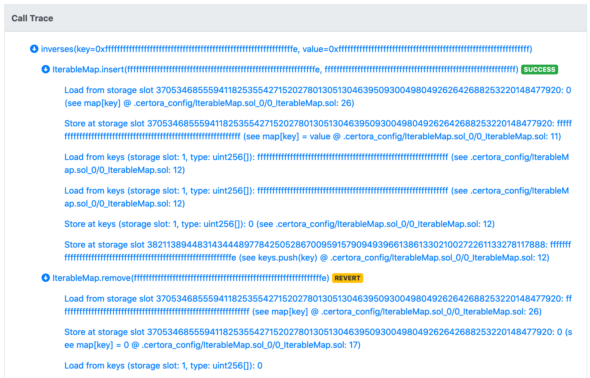
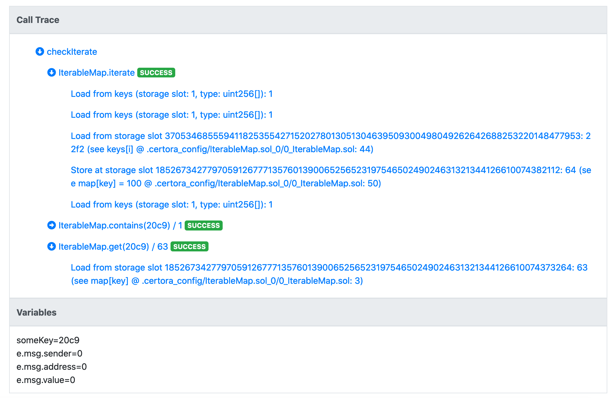
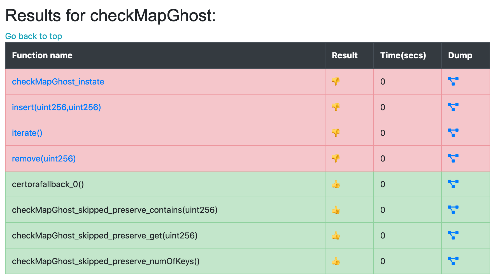

# An Iterable Map

### The IterableMap contract

The `IterableMap` will maintain an internal array of the keys inserted to the map. In the next section, we will add an iteration function.


```text
pragma solidity ^0.7.0;

contract IterableMap {
    mapping(uint => uint) internal map;
    function get(uint key) public view returns(uint) { return map[key]; }

    uint[] internal keys;
    function numOfKeys() external view returns (uint) { return keys.length; }

    function insert(uint key, uint value) external {
        require(value != 0, "0 is not a valid value");
        require (!contains(key), "key already exists");
        map[key] = value;
    }

    function remove(uint key) external {
        require (map[key] != 0, "Key does not exist");
        map[key] = 0;
        uint i = indexOf(key);
        if (i < keys.length - 1) {
            keys[i] = keys[keys.length-1];
        }
        keys.pop();
    }

    function contains(uint key) internal view returns (bool) {
        if (map[key] == 0) {
            return false;
        }

        return true;
    }

    function indexOf(uint key) internal view returns (uint) {
        for (uint i = 0 ; i < keys.length ; i++) {
            if (keys[i] == key) {
                return i;
            }
        }
        require(false, "Could not find key");
    }
}
```


We can now run the original spec file on the new contract. Unfortunately, not all rules are passing. The `inverses` rule is failing. The assertion message tells us `Unwinding condition in a loop`. It is the output whenever we encounter a loop that cannot be finitely unrolled. To avoid misdetections of bugs, the Prover outputs an assertion error in the loop's stop condition. We can control how many times the loops are unrolled, and in the future, the Prover will also support specification of inductive invariants for full loop coverage. In our example, we can start by simply assuming loops can be fully unrolled even if only unrolled once by specifying `--settings -assumeUnwindCond` in the command line for running the Prover.

Even then `inverses` still fails. Let's consider the call trace for this rule: 


We see that we were able to nullify the entry in the map, but the last operation that we see in the call trace under `remove` is that we load from `keys` a value of 0. It is known that the Solidity compiler associates the storage slot that of an array to its length. Here we see that the read length is 0. This means the `key` array is empty. However, it shouldn't have been empty after invoking `insert`. This is exactly the bug that we have in the code - we need to add the inserted key into the `keys` array:

```text
function insert(uint key, uint value) external {
    require(value != 0, "0 is not a valid value");
    require (!contains(key), "key already exists");
    map[key] = value;
    keys.push(key);
}
```

Oddly enough, the rule still fails:



It is still reported that the length of `keys` is 0, but this is unexpected. We examine the operations performed by `insert`, and we see that it loaded a length of `ff....ff`, and then stored a length of 0. That is, our array filled-up and reached the length of max `uint256`. This may look absurd or unrealistic, but that's where the power of the Prover lies - it doesn't miss any edge case. If we believe it is unrealistic for the length of `keys` to reach the maximum value, we should:

* assume that the length of the array is less than max `uint256`.
* assert that it is indeed infeasible to directly overwrite the length slot, or to increment the length by more than `1` in each operation.

We start by adding a simple assumption in the rule. \(We will later replace it with an assumption of an invariant, that will also assert that reaching max `uint256` is infeasible.\)

```text
rule inverses(uint key, uint value) {
    uint max_uint = 0xFFFFFFFFFFFFFFFFFFFFFFFFFFFFFFFFFFFFFFFFFFFFFFFFFFFFFF;
    require numOfKeys() < max_uint;
    env e;
    insert(e, key, value);
    env e2;
    require e2.msg.value == 0;
    remove@withrevert(e2, key);
    bool removeSucceeded = !lastReverted;
    assert removeSucceeded, "remove after insert must succeed";
    assert get(key) != value, "value of removed key must not be the inserted value";
}
```

\(don't forget to add `numOfKeys` to our `envfree` declarations!\)

#### Adding iteration

Our goal in adding the `keys` variable was to allow iteration over the keys. We start with an extremely simple example, that sets all keys' values to 100:

```text
function iterate() external {
    for (uint i = 0 ; i < keys.length ; i++) {
        uint key = keys[i];
        doSomething(key, get(key));
    }
}

function doSomething(uint key, uint value) virtual internal {
    map[key] = 100;
}
```

We also want to add a basic check rule:

```text
rule checkIterate() {
    env e;
    iterate(e);
    uint someKey;    
    require contains(someKey);
    assert get(someKey) == 100;
}
```

The rule fails with the following call trace:



Let's unpack what can be seen here. First, the length of the `keys` array is 1, and we read a key `22f2`. We then write `100` to it in the map and then `iterate` function is done. We then note that `someKey`, the key we want to check for, is not `22f2`, but rather `20c9`. While we assumed that it is contained in the map by using the `contains` function, it is not contained in the `keys` array. This is expected since the Prover's starting state can be completely arbitrary, subject to constraints that we specify on it. We wish to leave the `contains` function to be an `O(1)` complexity function, and rather provide the tool with the invariants that will allow it to see only states that "make sense", or in more precise terms, we only want to see states where the `keys` array contains exactly the same elements as the non-zero valued keys in the map.

In mathematical terms, the invariant that our `IterableMap` contract should satisfy is:

$$
\forall x. (map(x) \neq 0 \iff \exists i. 0\leq i \leq keys.length \land keys[i] =x)
$$

This invariant can be encoded directly in the spec file, as follows \(for convenience we assume `keys` is public and has a getter\):

```text
invariant inMapIffInArray(uint x) 
    get(x) != 0 <=> 
        (exists uint i. 0 <= i && i < getNumOfKeys() && keys(i) == x)
```

It is not recommended to invoke the underlying contract directly within quantified expressions \(such as `exists uint i. ...`\). The complexity of the underlying bytecode might lead to timeouts, and thus it is recommended to move to _ghost variables_. Ghost variables, once properly instrumented, allow us to write specs that are separated from the many technicalities of low-level bytecode and are thus a powerful abstraction tool. 

### A soft introduction to ghosts

We will write the above invariant using ghost variables exclusively. First, we will declare ghost variables for the underlying map structure as a function mapping keys to values:

```text
ghost _map(uint) returns uint;
```

The above declaration declares a _ghost function_. The ghost function takes a `uint` argument \(representing a key in the map\) and returns a `uint` value. We want `_map` to return for each given key the same value as the `map` in the code. We can state this property as an invariant:

```text
invariant checkMapGhost(uint someKey) get(someKey) == _map(someKey)
```

Currently, the rule fails for all state-mutating functions, and even in the contract's initial state after constructor \(rule `checkMapGhost_instate`\):



This is, in fact, unsurprising. There is nothing in the spec that links the value of the ghost to its Solidity counterpart. To make that link, we write _hooks_. Hooks allow us to instrument the verified code, that is, to wrap a bytecode operation with our own code, defined in the spec file. 

For example, we can hook on `SSTORE` operations that write to the underlying map as follows:

```text
hook Sstore map[KEY uint k] uint v STORAGE {
    havoc _map assuming _map@new(k) == v &&
        (forall uint k2. k2 != k => _map@new(k2) == _map@old(k2));
}
```

This hook will match every storage write to `map[k]`, denoting the written value by `v`. Optionally, and not shown in the syntax above, we can also specify the overwritten value of `map[k]`. The body of the hook is the injected code. It will apply `havoc` on the `_map` ghost, meaning that every key-value association it stored is "forgotten" by the prover and results in a completely new instance of `_map`. However, we restrict the new instance of `_map` using the old `_map` definition, with the `assuming ...` syntax. Under `assuming` we get a two-state context: we can see both old and new instances of `_map`, accessible with `_map@old` and `_map@new`. We require that `_map@old` and `_map@new` are the same for all keys except for `k`, the one we write to, and for `k` we require that `_map@new(k) == v`.

If we run `checkMapGhost` with only the `SSTORE` hook, the rule will pass for all functions but fail in the initial state, where no values were written. It is possible to specify initial state axioms on ghosts.

Similarly, one could define `SLOAD` hooks:

```text
hook Sload uint v map[KEY uint k] STORAGE {
    require _map(k) == v;
}
```

This hook says that every time the Prover encounters an `SLOAD` operation that reads the value `v` from `map[k]`, it will inject the code within the hook body after the `SLOAD`. This will make our `checkMapGhost` rule pass, but it's also become a tautology, because it's always true: by calling `get` we're already calling instrumented code that requires `_map(k) == v` whenever we load an arbitrary value `v` from the key `k`.

